# Data Pipeline Specification

This document provides a detailed specification of the Enviroflow ELT pipeline, including the data flow, table schemas, and key transformations at each stage.

## Pipeline Architecture

The pipeline is orchestrated by a modular, DAG-based CLI application. This design allows for flexibility, local development, and robust testing.

-   **Production Data Store**: All final tables are stored in **MotherDuck**.
-   **Local Development**: The pipeline can be run locally, using Parquet files as temporary storage for testing and generating "golden files" for validation.
-   **Orchestration**: A custom DAG (Directed Acyclic Graph) engine manages task dependencies and execution order.

## Development Pipeline (Modular CLI)

The primary pipeline is orchestrated by the modular, DAG-based CLI application. This design separates concerns into distinct command groups: `extract`, `transform`, `load`, and `validate`. This allows for flexible, independent execution of pipeline stages for development and testing.

The `run-all` command executes the entire DAG, managing dependencies between stages automatically.

```mermaid
graph TB
    %% CLI Command Groups
    subgraph " "
        direction LR
        A(Extract)
        B(Transform)
        C(Load)
        D(Validate)
    end

    %% Data Sources
    subgraph "External Sources"
        TrelloAPI[📋 Trello API]
        FloatAPI[⏰ Float API]
        XeroSheets[💰 Google Sheets P&L]
    end

    %% Orchestration
    subgraph "Orchestration"
        MotherDuck[(🦆 MotherDuck)]
        RunAll(run-all)
    end

    %% Stage 1: Extract
    subgraph "Extract Commands"
        TrelloAPI --> extract_trello(extract trello)
        FloatAPI --> extract_float(extract float)
        XeroSheets --> extract_xero_costs(extract xero-costs)
    end

    %% Stage 2: Load Raw Data
    subgraph "Load Raw to MotherDuck"
        extract_trello --> load_job_cards(load job_cards)
        extract_float --> load_labour_hours(load labour_hours)
        extract_xero_costs --> load_xero_costs(load xero_costs)
    end

    %% Link to MotherDuck
    load_job_cards --> MotherDuck
    load_labour_hours --> MotherDuck
    load_xero_costs --> MotherDuck

    %% Stage 3: Transform
    subgraph "Transform Commands"
        MotherDuck --> transform_quotes(transform quotes)
        MotherDuck --> transform_jobs(transform jobs)
        transform_quotes --> transform_jobs
        transform_jobs --> transform_customers(transform customers)
        transform_jobs --> transform_labour(transform labour)
        transform_labour --> transform_projects(transform projects)
        transform_projects --> transform_analytics(transform analytics)
    end

    %% Stage 4: Load Processed Data
    subgraph "Load Processed to MotherDuck"
        transform_quotes --> load_quotes(load quotes)
        transform_jobs --> load_jobs(load jobs)
        transform_customers --> load_customers(load customers)
        transform_labour --> load_jobs_with_hours(load jobs_with_hours)
        transform_projects --> load_projects(load projects)
        transform_analytics --> load_analytics(load projects_for_analytics)
    end

    %% Final Validation
    load_analytics --> Validate(validate all)

    %% Link run-all to top-level commands
    RunAll --> extract_trello
    RunAll --> extract_float
    RunAll --> extract_xero_costs

    %% Styling
    classDef apiSource fill:#e1f5fe,stroke:#01579b,stroke-width:2px
    classDef processStep fill:#f3e5f5,stroke:#4a148c,stroke-width:2px
    classDef orchestration fill:#fff8e1,stroke:#f57f17,stroke-width:3px
    classDef commandGroup fill:#e0f2f1,stroke:#00695c,stroke-width:3px

    class TrelloAPI,FloatAPI,XeroSheets apiSource
    class MotherDuck,RunAll orchestration
    class extract_trello,extract_float,extract_xero_costs,load_job_cards,load_labour_hours,load_xero_costs,transform_quotes,transform_jobs,transform_customers,transform_labour,transform_projects,transform_analytics,load_quotes,load_jobs,load_customers,load_jobs_with_hours,load_projects,load_analytics,Validate processStep
    class A,B,C,D commandGroup
```

## Production Pipeline (Automated Git Sync)

The current production data flow is simpler and is orchestrated by a GitHub Actions workflow running the `scripts/sync_data.py` script. This pipeline fetches data and commits it back to the Git repository.

## Table and Transformation Specifications

This section details the schema and key transformations for each table generated by the pipeline. The new CLI must produce tables that conform to these structures.

### Stage 1: Raw Data Extraction & Loading

#### 1.1 Trello Job Cards (`job_cards` table)
**Source**: Trello API (Multiple boards)
**Command**: `sync-trello`
**Target**: MotherDuck `job_cards` table

**Schema (47 columns)**:
- **Core Identifiers**: `name`, `id`, `short_url`, `url`, `board`, `status`
- **Customer Data**: `customer_name`, `customer_email`, `phone`, `second_contact`
- **Job Details**: `desc`, `address`, `labels` (List), `due` (DateTime)
- **Location**: `coordinates` (Struct), `static_map_url`, `latitude`, `longitude`
- **Project Management**: `project_manager`, `job_assigned_to`, `surveyed_by`, `report_by`
- **Quantities**: `asphalt_qty`, `concrete_qty`, `pipelining_qty` (Float64)
- **Financial**: `accepted_quote_value`, `quote_value`, `submitted_quote_value`, `variation_value` (Float64)
- **Timeline**: `due`, `survey_completed_on`, `sent_to_customer_date`, `work_started`, `work_completed` (DateTime)
- **EQC Claims**: `eqc_claim_number`, `eqc_claim_manager`, `eqc_approved_date`, `eqc_declined_date`
- **Technical**: `exposed_aggregate`, `exposed_ag_concrete`, `pipeline_patch_required` (Boolean)
- **Documents**: `attatchments` (List), drive links, etc.

**Key Transformations**:
- Complex custom field extraction from Trello cards.
- Coordinate parsing into structured latitude/longitude.
- Date standardization across multiple timezone formats.
- Boolean field processing for technical specifications.

#### 1.2 Float Labour Hours (`labour_hours` table)
**Source**: Float API (Resource scheduling)
**Command**: `sync-float`
**Target**: MotherDuck `labour_hours` table

**Schema (7 columns)**:
- `name` (String): Job identifier for matching.
- `start_date` (Date): Work start date.
- `end_date` (Date): Work end date.
- `employee` (String): Worker name.
- `daily_hours` (Float64): Hours per day.
- `num_days` (Int64): Number of working days.
- `total_hours` (Float64): Total hours worked.

**Key Transformations**:
- Job name standardization for cross-system matching.
- Date range processing for multi-day tasks.
- Hour aggregation calculations.
- Employee name normalization.

#### 1.3 Xero Costs (`xero_costs` table)
**Source**: Google Sheets P&L spreadsheet
**Command**: `sync-xero-costs`
**Target**: MotherDuck `xero_costs` table

**Schema (13 columns)**:
- `Date` (String): Transaction date.
- `Source` (String): Data source identifier.
- `Description` (String): Cost description.
- `Reference` (String): Transaction reference.
- `Debit`, `Credit`, `Gross`, `net`, `GST` (Float64): Financial amounts.
- `Account` (String): Chart of accounts reference.
- `xero_proj` (String): Original Xero project code.
- `Project` (String): Standardized project identifier.
- `Note` (Null): Additional notes field.

**Key Transformations**:
- Numeric string conversion (comma removal).
- Project identifier mapping (`xero_proj` → `Project`).
- GST calculation validation.
- Chart of accounts standardization.

### Stage 2: Quote Integration

#### 2.1 Unified Quotes (`quotes` table)
**Sources**: MotherDuck `full_xero_quotes` + `full_simpro_quotes`
**Command**: `build-quotes`
**Target**: MotherDuck `quotes` table

**Schema (12 columns)**:
- `quote_no` (String): Unique quote identifier.
- `quote_ref` (String): Customer reference/site.
- `customer` (String): Customer name.
- `quote_status` (String): Quote status (Xero only).
- `item_desc` (String): Line item description.
- `item_code` (String): Product/service code.
- `line_pct` (Float64): Line percentage of total quote.
- `quantity` (Float64): Quantity ordered.
- `unit_price` (Float64): Price per unit.
- `line_total` (Float64): Extended line total.
- `created` (Date): Quote creation date.
- `quote_source` (String): "Xero" or "Simpro".

**Key Transformations**:
- Schema normalization between Xero/Simpro systems.
- Column mapping (`site`→`quote_ref`, `item`→`item_desc`, `total`→`line_total`).
- Zero percentage correction (0 → 1.0).
- Date standardization across systems.
- Source system tagging.
- **`2.1_unified_quotes`**: Combines quotes from Simpro and Xero, then matches them to Trello jobs.
  - **Transformation Logic**:
    - **Union**: `simpro_quotes` and `xero_quotes` are combined into a single table.
    - **Matching**: The `match_quotes_to_jobs` function links quotes to jobs from `1.1_trello_job_cards`. The matching logic is critical:
      - The primary key for matching is the `quote_ref` column, which is expected to contain the Trello Job Name.
      - If `quote_ref` is null or empty, the logic falls back to using the `quote_no` as the matching key.
    - **Output**: Creates the `unified_quotes` table.
    - **Debug Table**: Any job from `1.1_trello_job_cards` that does not find a match is recorded in the `quotes_unmatched` table for review.
  - **Input Tables**: `1.1_trello_job_cards`, `raw_simpro_quotes`, `raw_xero_quotes`
  - **Output Table**: `2.1_unified_quotes`, `debug_quotes_unmatched`
  - **Schema: `unified_quotes`**
    | Column | Type | Description |
    |---|---|---|
    | `job_name` | `string` | **PK**. The name of the job from Trello. |
    | `quote_no` | `string` | The original quote number. |
    | `quote_ref` | `string` | The reference field from the quote, used for matching. |
    | `quote_status`| `string` | Status of the quote (e.g., 'Accepted', 'Invoiced'). |
    | `created` | `datetime`| Date the quote was created. |
    | `quote_source`| `string` | The origin of the quote ('xero' or 'simpro'). |
    | `quote_lines` | `list(struct)`| A nested list of structs containing line item details. |
    | `quote_value` | `float` | The total value of the quote. |
    | `is_primary` | `boolean` | Flag indicating if this is the primary quote for the job. |
    | `variation_no`| `integer` | The variation number if multiple quotes match a job. |

### Stage 3: Job Processing

#### 3.1 Structured Jobs (`jobs` table)
**Sources**: `job_cards` + `quotes` tables
**Command**: `build-jobs`
**Target**: MotherDuck `jobs` table

**Schema (31 columns)**:
- **Core**: `name`, `id`, `status`, `board`, `suburb`, `card_title`, `url`, `address`.
- **Customer**: `customer_details` (Struct): name, email, phone, second_contact.
- **Quantities**: `qty_from_card` (Struct): c_asphalt_qty, c_concrete_qty, c_pipelining_qty, c_quote_value, c_variation_value.
- **Timeline**: `timeline` (Struct): card_due, survey_completed_on, sent_to_customer_date, report_sent_to_eqc, eqc_approved_date, original_booking_date.
- **Personnel**: `surveyed_by`, `report_by`, `eqc_claim_manager`, `project_manager`, `job_assigned_to`, `concreter`.
- **Technical**: `desc`, `static_map_url`, `eqc_claim_number`, `longitude`, `latitude`.
- **Organization**: `labels` (List), `drive_folder_link` (List), `linked_cards` (List), `shared_with` (List).
- **Attachments**: `sorted_attatchments` (Struct): drive_folder, pictures, videos, documents, archives, emails, financials, other_links.
- **Business Logic**: `shared_drains` (Boolean).
- **Quotes**: `quotes` (List), `variation_quotes` (List).
- **Processing**: `parse_notes` (List).

**Key Transformations**:
- Complex object serialization for DuckDB compatibility.
- Quote matching by job number patterns.
- Customer detail extraction and structuring.
- Timeline consolidation across multiple date fields.
- Attachment categorization and organization.

#### 3.2 Job-Quote Mapping (`job_quote_mapping` table)
**Schema (6 columns)**:
- `job_name` (String): Job identifier.
- `job_no` (String): Job number.
- `quote_no` (String): Quote identifier.
- `quote_ref` (String): Quote reference.
- `match_type` (String): "primary", "variation", "no_match".
- `quote_value` (Float64): Total quote value.

### Stage 4: Customer Master Data

#### 4.1 Customers (`customers` table)
**Source**: `job_cards` table
**Schema (4 columns)**:
- `name` (String): Customer name.
- `email` (String): Contact email.
- `phone` (String): Contact phone.
- `job_names` (List): Associated job identifiers.

### Stage 5: Labour Integration

#### 5.1 Jobs with Hours (`jobs_with_hours` table)
**Schema (34 columns)**: All `jobs` columns plus:
- `labour_hours` (Float64): Total hours worked.
- `site_staff` (List): Workers assigned.
- `labour_records` (List): Detailed hour records.

#### 5.2 Jobs for Analytics (`jobs_for_analytics` table)
**Schema (45 columns)**: Enhanced with flattened structs:
- All `jobs_with_hours` columns.
- Flattened `qty_from_card`: `c_asphalt_qty`, `c_concrete_qty`, `c_pipelining_qty`, `c_quote_value`, `c_variation_value`.
- Flattened `timeline`: `card_due`, `survey_completed_on`, `sent_to_customer_date`, `report_sent_to_eqc`, `eqc_approved_date`, `original_booking_date`.

### Stage 6: Project Aggregation

#### 6.1 Projects (`projects` table)
**Schema (21 columns)**:
- **Core**: `name`, `shared_drains` (Boolean).
- **Jobs**: `job_names`, `job_ids`, `statuses` (Lists), `job_cards_urls` (List).
- **Personnel**: `surveyed_by`, `report_by`, `eqc_claim_manager`, `project_manager`, `assigned_to`, `site_staff` (List), `concreter`.
- **Performance**: `labour_hours` (Float64).
- **Quotes**: `quote_nos`, `variation_quote_nos` (Lists).
- **Aggregated Data**: `customer_details`, `qty_from_cards`, `timeline`, `labour_records`, `sum_qty_from_cards` (Serialized Strings).

### Stage 7: Enhanced Financial Analytics

#### 7.1 Projects for Analytics (`projects_for_analytics` table)
**Schema (34 columns)**:
- **Core Project Data**: `name`, `job_names` (List), `shared_drains`, `statuses` (List).
- **Timeline**: `original_booking_date`, `work_start`, `work_end`.
- **Personnel**: `surveyed_by`, `report_by`, `eqc_claim_manager`, `project_manager`, `assigned_to`, `site_staff` (List), `concreter`.
- **Financial Metrics**:
  - `total_quote_value` (Float64): Sum of all quotes.
  - `labour_hours` (Float64): Total labour hours.
  - `labour_cost_total` (Float64): Labour hours × $50/hour.
  - `supplier_costs_total` (Float64): Material/subcontractor costs.
  - `total_costs` (Float64): Labour + supplier costs.
  - `gross_profit` (Float64): Quote value - total costs.
  - `gp_margin_pct` (Float64): Gross profit percentage.
  - `est_proj_overhead` (Float64): 12% of quote value.
- **Location**: `latitude`, `longitude` (Float64).
- **References**: `job_cards_urls`, `job_ids`, `quote_nos`, `variation_quote_nos` (Lists).
- **Data Linkage**: `xero_costs_linked` (Boolean).
- **Serialized Complex Data**: `customer_details`, `qty_from_cards`, `timeline`, `labour_records`, `sum_qty_from_cards` (Strings).

## Production Data Validation Rules

#### 1. **Quote Volume Monotonicity**
- **Rule**: Quote lines can only increase over time (monotonic growth).
- **Logic**: New quotes get added, old quotes rarely get deleted.

#### 2. **Jobs ≤ Projects Relationship**
- **Rule**: Number of projects should always be ≤ number of jobs.
- **Logic**: Projects are aggregations of jobs, so there can't be more projects than jobs.

#### 3. **Pipeline Stage Row Consistency**
- **Rule**: Jobs tables should maintain identical row counts and job names across stages.
- **Tables**: `jobs`, `jobs_with_hours`, `jobs_for_analytics`.
- **Logic**: Adding labour data shouldn't change the number of jobs, just enhance them.

#### 4. **Project Stage Consistency**
- **Rule**: Project tables should maintain identical row counts and project names.
- **Tables**: `projects`, `projects_for_analytics`.
- **Logic**: Adding analytics shouldn't change which projects exist.

#### 5. **Job Cards Filtering Consistency**
- **Rule**: Jobs table should always be ≤ `job_cards` (some cards get filtered out).
- **Logic**: Not all Trello cards are actual jobs (admin cards, duplicates, etc. get removed).

#### 6. **Quote Matching Coverage**
- **Rule**: Quote matching success rate should stay above 92%.
- **Logic**: Most jobs should have quotes, very few should be unmatched.
- **Current**: 96.4% success rate (3,763 primary + 510 variations vs 158 no_match).

#### 7. **Unique Identifier Constraints**
- **Rule**: Key identifier columns should maintain 100% uniqueness.
- **Fields**: Job names in `jobs` table, project names in `projects` table.
- **Logic**: These are primary business identifiers and must be unique.

#### 8. **Quote Source Monotonicity**
- **Rule**: Simpro quotes stay constant (7,200), Xero quotes only increase (≥50,365).
- **Logic**: Simpro is legacy/static data, Xero is actively growing.

#### 9. **Business Date Range Consistency**
- **Rule**: All data dates should be later than business start date (2019-02-22).
- **Tables**: `labour_hours`, `xero_costs`, and other date fields.
- **Logic**: Business has only been operating since 2019, no data should predate this.

#### 10. **Schema Consistency Across Pipeline Stages**
- **Rule**: Table schemas should match expected structure exactly.
- **Implementation**: Pipeline code defines schemas, tests reference these definitions.
- **Logic**: Pipeline changes shouldn't accidentally add/remove/change column types.

### Built-in Data Validation
- **Schema Enforcement**: Pydantic models validate data types and structures.
- **Missing File Detection**: Pipeline checks for required inputs with helpful error messages.
- **Column Safety**: Safe handling of missing columns during transformations.
- **Business Rule Validation**: Ensures data integrity (e.g., positive quote values, valid dates).
- **Debug Tables**: Automatic generation of tables for excluded/problematic records.

### Debug Tables Generated
- **Job Processing**: Records excluded during job card parsing.
- **Quote Matching**: Jobs without matching quotes.
- **Labour Integration**: Hours that couldn't be matched to jobs.
- **Data Quality**: Invalid or suspicious records for manual review.
