# Temporary Onboarding Document (Work in Progress)

This document is a temporary consolidation of the project's documentation. It will be used to create a new, up-to-date onboarding guide for developers.

# From docs/dev_plan/00_Current_Status.md

# Current Status & Session Handover

## **🎯 CURRENT STATUS (August 12, 2025)**

### ✅ **COMPLETED MAJOR MILESTONE: Modular CLI Architecture**
The pipeline has been **completely refactored** from a monolithic script into a **modular, DAG-based CLI system**:

- **✅ NEW**: `enviroflow_app/cli/` - Complete modular CLI package with custom DAG orchestration.
- **✅ WORKING**: All 15+ pipeline commands are functional with Rich formatting. The core infrastructure is complete, though the operations logic consists of stubs.
- **✅ UPDATED**: Dependencies - Typer 0.12.5, Rich 13.9.4, Polars 1.32.2.
- **✅ PRESERVED**: The original, fully functional `scripts/pipeline_cli.py` is kept for reference and as a source for the real implementation logic.
- **✅ DOCUMENTED**: Comprehensive documentation is located in `project_documentation/`.

### 🔄 **NEXT PRIORITIES**
1. **Implement real operations logic**: Replace the stub functions in `enviroflow_app/cli/operations/` with the actual data processing logic from the legacy `scripts/pipeline_cli.py`.
2. **Connect DAG orchestration**: Link the DAG engine to the real data operations.
3. **Build pytest test suite**: Use the new modular structure to create a comprehensive test suite.
4. **Generate golden files**: Create a set of test data for validation.

## **📚 Session Handover Notes**

This section provides critical information for the next AI agent or developer to continue the work seamlessly.

### **Key Files for Continuation**
- **`project_documentation/in_progress/`**: This is the **primary source of truth** for the current project state. It contains:
    - `CLI_CONTINUATION_GUIDE.md`: High-level status and next steps.
    - `IMPLEMENTATION_DETAILS.md`: Technical patterns, critical fixes, and lessons learned.
    - `pipeline_cli_todo.md`: Detailed task lists and priorities.
- **`scripts/pipeline_cli.py`**: The legacy script. Use this as a **reference for the correct implementation logic** when replacing the stubs in the new CLI.
- **`enviroflow_app/cli/operations/`**: The directory where the new implementation work will take place.

### **Critical Compatibility Notes**

- **Typer + Rich Integration**: Use `rich_markup_mode=None` in the Typer app initialization to avoid errors.
- **Polars API**: Ensure all Polars calls use the modern API (e.g., `.map_elements()` instead of `.apply()`, `.group_by()` instead of `.groupby()`).
- **Circular Imports**: Use function-level imports within `@cached_property` methods in data models to prevent circular dependencies.

### **Development Workflow**
1. **Review the `project_documentation/in_progress/` folder** to fully understand the current state and the established patterns.
2. **Select a command** from the `pipeline_cli_todo.md` to implement.
3. **Locate the corresponding logic** in `scripts/pipeline_cli.py`.
4. **Implement the logic** in the appropriate file within `enviroflow_app/cli/operations/`.
5. **Test the command** using the new CLI entry point: `python -m enviroflow_app.cli.main <command>`.
6. **Update the documentation** in `project_documentation/in_progress/` to reflect the progress.

---
# From docs/dev_plan/02_Session_Handover_Notes.md

# Session Handover Notes for Next Developer

This document contains specific, actionable notes and proven patterns to ensure a smooth continuation of the development process.

## 🎯 Objective for Next Session

Your primary goal is to **implement the real data processing logic** within the newly created modular CLI framework. The architecture is complete; you are now responsible for populating it with the working code from the legacy system.

## 🛠️ Proven Implementation Patterns

Adhere to these established patterns to ensure consistency and avoid common issues.

### Command Implementation Template

Use this template when replacing stub functions in the `operations` modules. It includes best practices for console output, prerequisite checks, and error handling.

```python
from pathlib import Path
import typer
import polars as pl
from rich.console import Console

# Assuming 'console' is initialized elsewhere
console = Console()

def new_operation():
    """Operation description."""
    console.print("🔧 Starting operation...", style="bold blue")

    try:
        # 1. Check for and load prerequisite data
        prereq_path = Path("Data/cli_pipeline_data/processed_parquet/prerequisite.parquet")
        if not prereq_path.exists():
            console.print(f"[bold red]Error:[/bold red] Prerequisite file not found. Run the previous step first.")
            raise typer.Exit(code=1)

        df = pl.read_parquet(prereq_path)
        console.print(f"📊 Loaded {df.height:,} records from {prereq_path.name}")

        # 2. Apply transformation (reuse existing modules!)
        from enviroflow_app.elt.transform.some_module import SomeTransformClass

        result = SomeTransformClass(df).process()

        # 3. Handle Object columns before saving to Parquet
        output_path = Path("Data/cli_pipeline_data/processed_parquet/output.parquet")
        object_cols = [col for col, dtype in zip(result.columns, result.dtypes) if dtype == pl.Object]
        if object_cols:
            result = result.with_columns([
                pl.col(col).map_elements(str, return_dtype=pl.String) for col in object_cols
            ])

        result.write_parquet(output_path)

        # 4. Display results
        console.print(f"✅ Generated {result.height:,} records -> {output_path.name}", style="bold green")

    except Exception as e:
        console.print(f"❌ An unexpected error occurred: {e}", style="bold red")
        raise typer.Exit(code=1)
```

### Critical Technical Solutions

These are non-negotiable patterns required for the application to function correctly.

1.  **Polars API Compatibility**: You **must** use the modern Polars API.
    -   Use `.map_elements()` instead of `.apply()`.
    -   Use `.group_by()` instead of `.groupby()`.

2.  **Circular Import Prevention**: You **must** use function-level imports in data models (`enviroflow_app/model/*.py`) to avoid circular dependencies.
    ```python
    @cached_property
    def some_property(self):
        from enviroflow_app.elt.transform import SomeModule # Import here
        return SomeModule.process(self.data)
    ```

3.  **Typer/Rich Configuration**: You **must** initialize Typer apps with `rich_markup_mode=None` to prevent crashes.
    ```python
    app = typer.Typer(rich_markup_mode=None)
    ```

## 📞 If You Get Stuck

1.  **Consult the Legacy Code**: The file `scripts/pipeline_cli.py` contains the complete, working implementation. Use it as your primary reference for business logic.
2.  **Check for Prerequisite Files**: Many pipeline steps depend on the output of previous steps. Ensure the necessary input files exist in `Data/cli_pipeline_data/processed_parquet/`.
3.  **Review Debug Tables**: The legacy pipeline generates numerous debug tables. Run it and inspect these tables to understand data quality issues and edge cases.
4.  **Test Incrementally**: Do not try to implement everything at once. Replace one stub function, run that specific CLI command, and verify its output before moving to the next.

---
# From docs/dev_plan/03_Migration_Plan.md

# Migration Plan: Legacy to Modular CLI

**Objective**: Fully migrate the data processing logic from the legacy `scripts/pipeline_cli.py` into the new modular `enviroflow_app/cli/` framework. This will make the new CLI the single, authoritative tool for data orchestration.

---

## Phase 1: Extraction Logic Migration

**Goal**: Make the `extract` commands in the new CLI fully functional. Each task involves taking the logic from `scripts/pipeline_cli.py` and adapting it to the corresponding function in `enviroflow_app/cli/operations/extraction_ops.py`.

-   [x] **1.1: Implement `extract_trello_data`**
    -   [x] Adapt the Trello API fetching and processing logic from `_sync_trello()` in the legacy script.
    -   [x] Ensure the function saves the raw board data to `Data/cli_pipeline_data/raw_json/`.
    -   [x] Ensure the function saves the final `job_cards.parquet` to `Data/cli_pipeline_data/processed_parquet/`.
    -   [x] Ensure the function returns a dictionary containing the `job_cards` DataFrame as specified in the DAG.
    -   [x] **Test**: Run `python -m enviroflow_app.cli.main extract trello` and verify the output files.

-   [x] **1.2: Implement `extract_float_data`**
    -   [x] Adapt the logic from `sync_float()` in the legacy script.
    -   [x] Ensure it saves `float_labour_hours.json` and `labour_hours.parquet`.
    -   [x] **Test**: Run `python -m enviroflow_app.cli.main extract float` and verify outputs.

-   [x] **1.3: Implement `extract_xero_costs`**
    -   [x] Adapt the logic from `sync_xero_costs()`.
    -   [x] Ensure it saves `xero_costs.json` and `xero_costs.parquet`.
    -   [x] **Test**: Run `python -m enviroflow_app.cli.main extract xero-costs` and verify outputs.

-   [x] **1.4: Implement `extract_legacy_data`**
    -   [x] Adapt the logic from `sync_legacy()`.
    -   [x] Ensure it correctly loads miscellaneous data files and saves them to the processed directory.
    -   [x] **Test**: Run `python -m enviroflow_app.cli.main extract legacy` and verify outputs.

## Phase 1.5: Google Sheets P&L Integration (IN PROGRESS)

**Goal**: Replace static file dependencies with live Google Sheets P&L data extraction and complete legacy folder migration.

-   [x] **1.5.1: Comprehensive Google Sheets Framework Implementation** ✅ **COMPLETED**
    -   [x] **Enhanced GoogleSheetsClient** with SSL configuration for WSL environments
        - **Location:** `enviroflow_app/gsheets/gsheets.py`
        - **Features:** Auto-detection of WSL, SSL bypass, header detection, pagination handling
        - **Validation:** All edge cases from terminal testing resolved
    -   [x] **Flexible Parser Framework** with injectable parsing functions
        - **Location:** `enviroflow_app/gsheets/parsers.py`
        - **Components:**
          - `StandardTableParser` - Basic table parsing with intelligent header detection
          - `OffsetHeaderParser` - For tables with headers not in row 1 (e.g., report_scope_projects row 2)
          - `MultiTableParser` - For sheets with multiple tables separated by blank rows (constants)
          - `PaginatedTableParser` - For large tables requiring pagination detection (costs)
        - **Factory Pattern:** `ParserFactory` with pre-configured P&L table parsers
    -   [x] **P&L Enhanced Client** with specialized methods
        - **Location:** `enviroflow_app/gsheets/pnl_client.py`
        - **Features:** Pre-configured parsers, batch extraction, validation, constants multi-table handling
        - **API:** `extract_pnl_table()`, `extract_all_pnl_tables()`, `extract_pnl_constants_tables()`
    -   [x] **Comprehensive Test Suite** with real-world validation
        - **Files:** `tests/test_gsheets_client.py`, `tests/test_pnl_parsers.py`
        - **Coverage:** Authentication, data consistency, pagination detection, multiple engines, performance
        - **Integration:** All arbitrary checks from development terminal sessions incorporated

-   [ ] **1.5.2: P&L Table Structure Discovery & Configuration** 🔄 **IN PROGRESS**
    -   [ ] **CRITICAL:** Inspect actual P&L spreadsheet table structures to get real column names
        - **Status:** Test suite has placeholder column expectations that need real data
        - **Action:** User to provide actual table structure information for each target table
    -   [ ] **Target Tables Configuration:**
        - [ ] `costs` → `pnl_costs` (CRITICAL: fix pagination from 999 to ~13k records)
        - [ ] `constants` → `pnl_constants_*` (multi-table: labour_constants, account_categories, units, subcontractors)
        - [ ] `report_scope_projects` → `pnl_report_scope_projects` (headers in row 2, confirmed)
        - [ ] `xero_name` → `pnl_xero_name`
        - [ ] `sales` → `pnl_sales`
        - [ ] `quotes` → `pnl_original_quotes`
        - [ ] `pricing_table` → `pnl_pricing_table`

-   [ ] **1.5.3: MotherDuck Integration & CLI Commands**
    -   [ ] Create `extract_pnl_tables()` function in `extraction_ops.py`
    -   [ ] Add MotherDuck loading with `pnl_` prefix naming convention
    -   [ ] Add CLI command: `python -m enviroflow_app.cli.main extract pnl-tables`
    -   [ ] Add comprehensive logging and record count validation
    -   [ ] **CRITICAL:** Validate costs table gets full ~13k records (not paginated 999)

-   [ ] **1.5.4: Pipeline Integration & Legacy Migration**
    -   [ ] Update `extract_xero_costs()` to use new P&L extraction instead of static file
    -   [ ] Update all pipeline dependencies to use MotherDuck `pnl_*` tables
    -   [ ] Add P&L extraction to main pipeline DAG
    -   [ ] **COMPLETION:** Remove entire legacy folder after successful migration
    -   [ ] Update GitHub Actions to use live P&L extraction

---

## Phase 2: Transformation Logic Migration

**Goal**: Make the `transform` commands fully functional by implementing the core business logic in `enviroflow_app/cli/operations/transform_ops.py`.

-   [x] **2.1: Implement `build_quotes_table`**
    -   [x] Adapt the logic from `build_quotes()` and `stitch_quotes_from_test_data()`.
    -   [x] This function should now read its source data (`xero_quotes_complete.parquet`, `simpro_quotes_complete.parquet`) from the DAG context (which will be passed from the extraction phase).
    -   [x] Ensure it saves the final `quotes.parquet`.
    -   [x] **Test**: Run `python -m enviroflow_app.cli.main transform quotes` and validate the output against the legacy version.

-   [x] **2.2: Implement `build_jobs_table`**
    -   [x] Adapt the logic from `build_jobs()`.
    -   [x] Ensure it saves `jobs.parquet` and the `job_quote_mapping.parquet` debug table.
    -   [x] **Test**: Run `python -m enviroflow_app.cli.main transform jobs`.

-   [x] **2.3: Implement `build_customers_table`**
    -   [x] Adapt the logic from `build_customers()`.
    -   [x] **Test**: Run `python -m enviroflow_app.cli.main transform customers`.

-   [x] **2.4: Implement `add_labour_to_jobs`**
    -   [x] Adapt the logic from `add_labour()`.
    -   [x] Ensure it saves `jobs_with_hours.parquet` and `jobs_for_analytics.parquet`.
    -   [x] **Test**: Run `python -m enviroflow_app.cli.main transform labour`.

-   [x] **2.5: Implement `build_projects_table`**
    -   [x] Adapt the logic from `build_projects()`.
    -   [x] **Test**: Run `python -m enviroflow_app.cli.main transform projects`.

-   [x] **2.6: Implement `build_projects_analytics`**
    -   [x] Adapt the logic from `build_projects_analytics()`.
    -   [x] This is the final, most complex transformation.
    -   [x] **Test**: Run `python -m enviroflow_app.cli.main transform analytics`.
    -   [ ] **BLOCKED**: Requires accurate cost data from Phase 1.5 P&L integration for proper analytics

---

## Phase 3: Integration and Production Cutover

**Goal**: Make the new CLI the primary production pipeline.

-   [x] **3.1: Full Pipeline Test**
    -   [x] Run the end-to-end pipeline with `python -m enviroflow_app.cli.main run-all`.
    -   [x] Verify that all tables in MotherDuck are correctly generated and match the output of the legacy script.
    -   [x] **Added**: An automated integration test (`tests/integration/test_pipeline.py`) now exists to formalize this step and prevent regressions.
    -   [ ] **PENDING**: Re-validate after P&L integration with accurate cost data

-   [ ] **3.2: Update GitHub Actions Workflow**
    -   [ ] Modify `.github/workflows/actions.yml`.
    -   [ ] Change the `run the sync script` step to execute the new CLI: `python -m poetry run python -m enviroflow_app.cli.main run-all`.
    -   [ ] Remove the `Update repo` step (`git-auto-commit-action`), as the new pipeline writes directly to MotherDuck, not back to the repo.
    -   [ ] **DEPENDENCY**: Complete after P&L integration to ensure production data accuracy

---

## Phase 4: Deprecation and Cleanup

**Goal**: Remove obsolete files and finalize documentation.

-   [ ] **4.1: Deprecate Legacy Scripts**
    -   [ ] Delete `scripts/pipeline_cli.py`.
    -   [ ] Delete `scripts/sync_data.py`.

-   [ ] **4.2: Update Documentation**
    -   [ ] Remove all references to the legacy scripts from the `/docs`.
    -   [ ] Update the `README.md` to reflect that the new CLI is the only pipeline.
    -   [ ] Archive this migration plan.

---

## Future Goal: Streamlit Integration

-   [ ] **5.1: Integrate DAG Engine into Streamlit**
    -   [ ] Create a new "Pipeline Status" or "Run Pipeline" page in the Streamlit app.
    -   [ ] Adapt the `DAGEngine` to be callable from Streamlit, providing real-time progress updates to the UI using `st.spinner` and `st.progress`.
    -   [ ] This will allow for manual pipeline runs to be triggered directly from the web interface.

-   [ ] **5.2: P&L Reports Dashboard Migration**
    -   [ ] **Goal:** Migrate reports currently in P&L spreadsheet to Streamlit dashboard
    -   [ ] **Phase 1:** Extract constants tables (labour_constants, account_categories, units, subcontractors) for current reports
    -   [ ] **Phase 2:** Build Streamlit interface for constants management (replace spreadsheet editing)
    -   [ ] **Phase 3:** Recreate P&L reports in Streamlit with editable constants
    -   [ ] **Phase 4:** Retire P&L spreadsheet dependency for reporting (keep only as data source)

---
# From docs/dev_notes/00_Project_Overview.md

# Project Overview

Enviroflow App is a Streamlit-based business intelligence application built for a drainage and construction company. Its core function is to implement a robust ELT (Extract-Load-Transform) pipeline, integrating data from disparate sources like Trello, Xero, Float, and Google Sheets into a centralized MotherDuck (cloud DuckDB) instance for comprehensive project performance analysis.

The project features an automated data synchronization process using GitHub Actions, which ensures that data from key sources is fetched and updated on an hourly basis.

## Purpose

The primary goals of the application are to:
1.  **Centralize Data**: Aggregate data from various business systems into a single source of truth.
2.  **Enable Business Intelligence**: Provide powerful job costing analysis and financial insights.
3.  **Support Decision-Making**: Equip the team with up-to-date information for better planning.
4.  **Automate Processes**: Streamline routine tasks such as generating subcontractor agreements.

## Technology Stack

The application is built with a modern, Python-centric technology stack:

-   **Frontend**: [Streamlit](https://streamlit.io/) for creating interactive web interfaces.
-   **Database**: [MotherDuck](https://motherduck.com/) for cloud-hosted DuckDB storage and analytics.
-   **Data Processing**:
    -   [Polars](https://pola.rs/) for high-performance DataFrame manipulation.
    -   [Pandas](https://pandas.pydata.org/) for data analysis and compatibility.
-   **CLI**: [Typer](https://typer.tiangolo.com/) and [Rich](https://rich.readthedocs.io/en/latest/) for a modern, user-friendly command-line interface.
-   **Development**: [Poetry](https://python-poetry.org/) for dependency management.
-   **CI/CD**: [GitHub Actions](https://github.com/features/actions) for automated data synchronization.

## External Integrations

The pipeline extracts data from several key business systems:

-   **Trello**: Project management, job tracking, and workflow status.
-   **Xero**: Financial data, invoices, and supplier costs (currently via manual report uploads).
-   **Float**: Resource scheduling and labor allocation.
-   **Google Sheets**: Legacy data and supplementary manual data entry.
-   **Simpro**: Service management software data.
---
# From docs/dev_notes/01_Architecture_And_Data_Flow.md

# Architecture and Data Flow

This document outlines the core architecture of the Enviroflow App, its key components, and the flow of data through the system.

## Core Architecture

The application is designed with a clear separation of concerns, organizing the system into distinct layers for data processing, business logic, and presentation.

### Key Components

-   **`enviroflow_app/`**: The main application package.
    -   **`🏠_Home.py`**: The primary entry point for the Streamlit application.
    -   **`cli/`**: The new modular, DAG-based command-line interface for pipeline orchestration.
    -   **`elt/`**: The core Extract, Load, and Transform components.
        -   **`motherduck/`**: A dedicated wrapper for all MotherDuck database interactions.
        -   **`trello/`**, **`gsheets/`**: Modules for integrating with external APIs.
        -   **`transform/`**: The heart of the business logic, containing all data transformation modules.
    -   **`model/`**: Contains the core business entity data models (`Project`, `Job`, `Quote`), which use `@cached_property` for efficient, on-demand calculations.
    -   **`pages/`**: Individual Streamlit pages, numbered with emoji prefixes for sidebar ordering.
    -   **`st_components/`**: Reusable Streamlit components, including session state management (`pre.py`) and UI widgets.

### Data Flow Pattern

The application follows a standard ELT (Extract-Load-Transform) pattern, which is orchestrated by the CLI pipeline:

1.  **Extract**: Raw data is pulled from source APIs (Trello, Float, etc.) and external files (Google Sheets).
2.  **Load**: The raw, unprocessed data is loaded directly into corresponding tables in MotherDuck. This ensures data integrity and provides a source for reprocessing if needed.
3.  **Transform**: SQL queries and Polars DataFrames are used to transform the raw data in MotherDuck into structured, analytics-ready tables and business objects (`Project`, `Job`).
4.  **Present**: The final, transformed data is exposed through the Streamlit application, where it is loaded into cached session state for fast, interactive use in the UI.

## Production vs. Development Pipelines

It is crucial to understand that the project currently operates with two distinct data pipelines:

### 1. Production Data Sync (Automated)

-   **Trigger**: Runs hourly via a GitHub Actions workflow (`.github/workflows/actions.yml`).
-   **Orchestration**: Driven by the legacy script `scripts/sync_data.py`.
-   **Process**:
    1.  Fetches the latest data from the Trello API.
    2.  Saves the raw data as CSV files within the `Data/trello_data/` directory.
    3.  Runs transformations to create derived tables (e.g., `quotes.parquet`, `jobs.parquet`) in `Data/derived/`.
    4.  Commits the updated data files directly back to the Git repository.
-   **Outcome**: This process ensures the data within the repository is always up-to-date, and the Streamlit application reads from these committed files.

### 2. Development CLI Pipeline (Manual)

-   **Trigger**: Manual execution by a developer from the command line.
-   **Orchestration**: Driven by the new modular CLI (`enviroflow_app/cli/main.py`).
-   **Process**:
    1.  Follows the ELT pattern defined by the DAG engine.
    2.  Extracts from APIs, loads raw data to MotherDuck, and runs transformations within the database.
-   **Outcome**: This is the future-state, more robust pipeline. Currently, its core operations are stubs and it is not used for production data processing. Its purpose is for development and will eventually replace the legacy sync script.

## Data Model Relationships

The business logic is built around a hierarchy of core data models.

### Core Entity Hierarchy

-   **Project**: The top-level entity, which contains one or more related **Jobs**. A project aggregates all financial and operational data from its constituent jobs.
-   **Job**: An individual unit of work, typically corresponding to a Trello card. A job can have multiple **Quotes** associated with it (e.g., an original quote and subsequent variations).
-   **Quote**: Represents a financial quote from Xero or Simpro, containing line items and pricing details.

*Note: To ensure compatibility with DuckDB, complex data structures within the models (like timelines or customer details) are serialized to strings before being saved to the database.*

### Financial Calculations

The `Project` model contains the core financial logic, with calculations chained together using cached properties:

```
// Core calculation flow in the Project model
total_quote_value  -> merged_quotes.quote_value
labour_costs_total -> labour_hours * LABOUR_RATE
supplier_costs_total -> sum(supplier_costs["Gross"])
total_costs        -> labour_costs_total + supplier_costs_total
gross_profit       -> total_quote_value - total_costs
gp_margin_pct      -> gross_profit / total_quote_value
```
---
# From docs/dev_notes/02_Pipeline_Specification.md

# Data Pipeline Specification

This document provides a detailed specification of the Enviroflow ELT pipeline, including the data flow, table schemas, and key transformations at each stage.

## Pipeline Architecture

The pipeline is orchestrated by a modular, DAG-based CLI application. This design allows for flexibility, local development, and robust testing.

-   **Production Data Store**: All final tables are stored in **MotherDuck**.
-   **Local Development**: The pipeline can be run locally, using Parquet files as temporary storage for testing and generating "golden files" for validation.
-   **Orchestration**: A custom DAG (Directed Acyclic Graph) engine manages task dependencies and execution order.

## Development Pipeline (Modular CLI)

The primary pipeline is orchestrated by the modular, DAG-based CLI application. This design separates concerns into distinct command groups: `extract`, `transform`, `load`, and `validate`. This allows for flexible, independent execution of pipeline stages for development and testing.

The `run-all` command executes the entire DAG, managing dependencies between stages automatically.

```mermaid
graph TB
    %% CLI Command Groups
    subgraph " "
        direction LR
        A(Extract)
        B(Transform)
        C(Load)
        D(Validate)
    end

    %% Data Sources
    subgraph "External Sources"
        TrelloAPI[📋 Trello API]
        FloatAPI[⏰ Float API]
        XeroSheets[💰 Google Sheets P&L]
    end

    %% Orchestration
    subgraph "Orchestration"
        MotherDuck[(🦆 MotherDuck)]
        RunAll(run-all)
    end

    %% Stage 1: Extract
    subgraph "Extract Commands"
        TrelloAPI --> extract_trello(extract trello)
        FloatAPI --> extract_float(extract float)
        XeroSheets --> extract_xero_costs(extract xero-costs)
    end

    %% Stage 2: Load Raw Data
    subgraph "Load Raw to MotherDuck"
        extract_trello --> load_job_cards(load job_cards)
        extract_float --> load_labour_hours(load labour_hours)
        extract_xero_costs --> load_xero_costs(load xero_costs)
    end

    %% Link to MotherDuck
    load_job_cards --> MotherDuck
    load_labour_hours --> MotherDuck
    load_xero_costs --> MotherDuck

    %% Stage 3: Transform
    subgraph "Transform Commands"
        MotherDuck --> transform_quotes(transform quotes)
        MotherDuck --> transform_jobs(transform jobs)
        transform_quotes --> transform_jobs
        transform_jobs --> transform_customers(transform customers)
        transform_jobs --> transform_labour(transform labour)
        transform_labour --> transform_projects(transform projects)
        transform_projects --> transform_analytics(transform analytics)
    end

    %% Stage 4: Load Processed Data
    subgraph "Load Processed to MotherDuck"
        transform_quotes --> load_quotes(load quotes)
        transform_jobs --> load_jobs(load jobs)
        transform_customers --> load_customers(load customers)
        transform_labour --> load_jobs_with_hours(load jobs_with_hours)
        transform_projects --> load_projects(load projects)
        transform_analytics --> load_analytics(load projects_for_analytics)
    end

    %% Final Validation
    load_analytics --> Validate(validate all)

    %% Link run-all to top-level commands
    RunAll --> extract_trello
    RunAll --> extract_float
    RunAll --> extract_xero_costs

    %% Styling
    classDef apiSource fill:#e1f5fe,stroke:#01579b,stroke-width:2px
    classDef processStep fill:#f3e5f5,stroke:#4a148c,stroke-width:2px
    classDef orchestration fill:#fff8e1,stroke:#f57f17,stroke-width:3px
    classDef commandGroup fill:#e0f2f1,stroke:#00695c,stroke-width:3px

    class TrelloAPI,FloatAPI,XeroSheets apiSource
    class MotherDuck,RunAll orchestration
    class extract_trello,extract_float,extract_xero_costs,load_job_cards,load_labour_hours,load_xero_costs,transform_quotes,transform_jobs,transform_customers,transform_labour,transform_projects,transform_analytics,load_quotes,load_jobs,load_customers,load_jobs_with_hours,load_projects,load_analytics,Validate processStep
    class A,B,C,D commandGroup
```



## Production Pipeline (Automated Git Sync)

The current production data flow is simpler and is orchestrated by a GitHub Actions workflow running the `scripts/sync_data.py` script. This pipeline fetches data and commits it back to the Git repository.


## Table and Transformation Specifications

This section details the schema and key transformations for each table generated by the pipeline. The new CLI must produce tables that conform to these structures.

### Stage 1: Raw Data Extraction & Loading

#### 1.1 Trello Job Cards (`job_cards` table)
**Source**: Trello API (Multiple boards)
**Command**: `sync-trello`
**Target**: MotherDuck `job_cards` table

**Schema (47 columns)**:
- **Core Identifiers**: `name`, `id`, `short_url`, `url`, `board`, `status`
- **Customer Data**: `customer_name`, `customer_email`, `phone`, `second_contact`
- **Job Details**: `desc`, `address`, `labels` (List), `due` (DateTime)
- **Location**: `coordinates` (Struct), `static_map_url`, `latitude`, `longitude`
- **Project Management**: `project_manager`, `job_assigned_to`, `surveyed_by`, `report_by`
- **Quantities**: `asphalt_qty`, `concrete_qty`, `pipelining_qty` (Float64)
- **Financial**: `accepted_quote_value`, `quote_value`, `submitted_quote_value`, `variation_value` (Float64)
- **Timeline**: `due`, `survey_completed_on`, `sent_to_customer_date`, `work_started`, `work_completed` (DateTime)
- **EQC Claims**: `eqc_claim_number`, `eqc_claim_manager`, `eqc_approved_date`, `eqc_declined_date`
- **Technical**: `exposed_aggregate`, `exposed_ag_concrete`, `pipeline_patch_required` (Boolean)
- **Documents**: `attatchments` (List), drive links, etc.

**Key Transformations**:
- Complex custom field extraction from Trello cards.
- Coordinate parsing into structured latitude/longitude.
- Date standardization across multiple timezone formats.
- Boolean field processing for technical specifications.

#### 1.2 Float Labour Hours (`labour_hours` table)
**Source**: Float API (Resource scheduling)
**Command**: `sync-float`
**Target**: MotherDuck `labour_hours` table

**Schema (7 columns)**:
- `name` (String): Job identifier for matching.
- `start_date` (Date): Work start date.
- `end_date` (Date): Work end date.
- `employee` (String): Worker name.
- `daily_hours` (Float64): Hours per day.
- `num_days` (Int64): Number of working days.
- `total_hours` (Float64): Total hours worked.

**Key Transformations**:
- Job name standardization for cross-system matching.
- Date range processing for multi-day tasks.
- Hour aggregation calculations.
- Employee name normalization.

#### 1.3 Xero Costs (`xero_costs` table)
**Source**: Google Sheets P&L spreadsheet
**Command**: `sync-xero-costs`
**Target**: MotherDuck `xero_costs` table

**Schema (13 columns)**:
- `Date` (String): Transaction date.
- `Source` (String): Data source identifier.
- `Description` (String): Cost description.
- `Reference` (String): Transaction reference.
- `Debit`, `Credit`, `Gross`, `net`, `GST` (Float64): Financial amounts.
- `Account` (String): Chart of accounts reference.
- `xero_proj` (String): Original Xero project code.
- `Project` (String): Standardized project identifier.
- `Note` (Null): Additional notes field.

**Key Transformations**:
- Numeric string conversion (comma removal).
- Project identifier mapping (`xero_proj` → `Project`).
- GST calculation validation.
- Chart of accounts standardization.

### Stage 2: Quote Integration

#### 2.1 Unified Quotes (`quotes` table)
**Sources**: MotherDuck `full_xero_quotes` + `full_simpro_quotes`
**Command**: `build-quotes`
**Target**: MotherDuck `quotes` table

**Schema (12 columns)**:
- `quote_no` (String): Unique quote identifier.
- `quote_ref` (String): Customer reference/site.
- `customer` (String): Customer name.
- `quote_status` (String): Quote status (Xero only).
- `item_desc` (String): Line item description.
- `item_code` (String): Product/service code.
- `line_pct` (Float64): Line percentage of total quote.
- `quantity` (Float64): Quantity ordered.
- `unit_price` (Float64): Price per unit.
- `line_total` (Float64): Extended line total.
- `created` (Date): Quote creation date.
- `quote_source` (String): "Xero" or "Simpro".

**Key Transformations**:
- Schema normalization between Xero/Simpro systems.
- Column mapping (`site`→`quote_ref`, `item`→`item_desc`, `total`→`line_total`).
- Zero percentage correction (0 → 1.0).
- Date standardization across systems.
- Source system tagging.
- **`2.1_unified_quotes`**: Combines quotes from Simpro and Xero, then matches them to Trello jobs.
  - **Transformation Logic**:
    - **Union**: `simpro_quotes` and `xero_quotes` are combined into a single table.
    - **Matching**: The `match_quotes_to_jobs` function links quotes to jobs from `1.1_trello_job_cards`. The matching logic is critical:
      - The primary key for matching is the `quote_ref` column, which is expected to contain the Trello Job Name.
      - If `quote_ref` is null or empty, the logic falls back to using the `quote_no` as the matching key.
    - **Output**: Creates the `unified_quotes` table.
    - **Debug Table**: Any job from `1.1_trello_job_cards` that does not find a match is recorded in the `quotes_unmatched` table for review.
  - **Input Tables**: `1.1_trello_job_cards`, `raw_simpro_quotes`, `raw_xero_quotes`
  - **Output Table**: `2.1_unified_quotes`, `debug_quotes_unmatched`
  - **Schema: `unified_quotes`**
    | Column | Type | Description |
    |---|---|---|
    | `job_name` | `string` | **PK**. The name of the job from Trello. |
    | `quote_no` | `string` | The original quote number. |
    | `quote_ref` | `string` | The reference field from the quote, used for matching. |
    | `quote_status`| `string` | Status of the quote (e.g., 'Accepted', 'Invoiced'). |
    | `created` | `datetime`| Date the quote was created. |
    | `quote_source`| `string` | The origin of the quote ('xero' or 'simpro'). |
    | `quote_lines` | `list(struct)`| A nested list of structs containing line item details. |
    | `quote_value` | `float` | The total value of the quote. |
    | `is_primary` | `boolean` | Flag indicating if this is the primary quote for the job. |
    | `variation_no`| `integer` | The variation number if multiple quotes match a job. |

### Stage 3: Job Processing

#### 3.1 Structured Jobs (`jobs` table)
**Sources**: `job_cards` + `quotes` tables
**Command**: `build-jobs`
**Target**: MotherDuck `jobs` table

**Schema (31 columns)**:
- **Core**: `name`, `id`, `status`, `board`, `suburb`, `card_title`, `url`, `address`.
- **Customer**: `customer_details` (Struct): name, email, phone, second_contact.
- **Quantities**: `qty_from_card` (Struct): c_asphalt_qty, c_concrete_qty, c_pipelining_qty, c_quote_value, c_variation_value.
- **Timeline**: `timeline` (Struct): card_due, survey_completed_on, sent_to_customer_date, report_sent_to_eqc, eqc_approved_date, original_booking_date.
- **Personnel**: `surveyed_by`, `report_by`, `eqc_claim_manager`, `project_manager`, `job_assigned_to`, `concreter`.
- **Technical**: `desc`, `static_map_url`, `eqc_claim_number`, `longitude`, `latitude`.
- **Organization**: `labels` (List), `drive_folder_link` (List), `linked_cards` (List), `shared_with` (List).
- **Attachments**: `sorted_attatchments` (Struct): drive_folder, pictures, videos, documents, archives, emails, financials, other_links.
- **Business Logic**: `shared_drains` (Boolean).
- **Quotes**: `quotes` (List), `variation_quotes` (List).
- **Processing**: `parse_notes` (List).

**Key Transformations**:
- Complex object serialization for DuckDB compatibility.
- Quote matching by job number patterns.
- Customer detail extraction and structuring.
- Timeline consolidation across multiple date fields.
- Attachment categorization and organization.

#### 3.2 Job-Quote Mapping (`job_quote_mapping` table)
**Schema (6 columns)**:
- `job_name` (String): Job identifier.
- `job_no` (String): Job number.
- `quote_no` (String): Quote identifier.
- `quote_ref` (String): Quote reference.
- `match_type` (String): "primary", "variation", "no_match".
- `quote_value` (Float64): Total quote value.

### Stage 4: Customer Master Data

#### 4.1 Customers (`customers` table)
**Source**: `job_cards` table
**Schema (4 columns)**:
- `name` (String): Customer name.
- `email` (String): Contact email.
- `phone` (String): Contact phone.
- `job_names` (List): Associated job identifiers.

### Stage 5: Labour Integration

#### 5.1 Jobs with Hours (`jobs_with_hours` table)
**Schema (34 columns)**: All `jobs` columns plus:
- `labour_hours` (Float64): Total hours worked.
- `site_staff` (List): Workers assigned.
- `labour_records` (List): Detailed hour records.

#### 5.2 Jobs for Analytics (`jobs_for_analytics` table)
**Schema (45 columns)**: Enhanced with flattened structs:
- All `jobs_with_hours` columns.
- Flattened `qty_from_card`: `c_asphalt_qty`, `c_concrete_qty`, `c_pipelining_qty`, `c_quote_value`, `c_variation_value`.
- Flattened `timeline`: `card_due`, `survey_completed_on`, `sent_to_customer_date`, `report_sent_to_eqc`, `eqc_approved_date`, `original_booking_date`.

### Stage 6: Project Aggregation

#### 6.1 Projects (`projects` table)
**Schema (21 columns)**:
- **Core**: `name`, `shared_drains` (Boolean).
- **Jobs**: `job_names`, `job_ids`, `statuses` (Lists), `job_cards_urls` (List).
- **Personnel**: `surveyed_by`, `report_by`, `eqc_claim_manager`, `project_manager`, `assigned_to`, `site_staff` (List), `concreter`.
- **Performance**: `labour_hours` (Float64).
- **Quotes**: `quote_nos`, `variation_quote_nos` (Lists).
- **Aggregated Data**: `customer_details`, `qty_from_cards`, `timeline`, `labour_records`, `sum_qty_from_cards` (Serialized Strings).

### Stage 7: Enhanced Financial Analytics

#### 7.1 Projects for Analytics (`projects_for_analytics` table)
**Schema (34 columns)**:
- **Core Project Data**: `name`, `job_names` (List), `shared_drains`, `statuses` (List).
- **Timeline**: `original_booking_date`, `work_start`, `work_end`.
- **Personnel**: `surveyed_by`, `report_by`, `eqc_claim_manager`, `project_manager`, `assigned_to`, `site_staff` (List), `concreter`.
- **Financial Metrics**:
  - `total_quote_value` (Float64): Sum of all quotes.
  - `labour_hours` (Float64): Total labour hours.
  - `labour_cost_total` (Float64): Labour hours × $50/hour.
  - `supplier_costs_total` (Float64): Material/subcontractor costs.
  - `total_costs` (Float64): Labour + supplier costs.
  - `gross_profit` (Float64): Quote value - total costs.
  - `gp_margin_pct` (Float64): Gross profit percentage.
  - `est_proj_overhead` (Float64): 12% of quote value.
- **Location**: `latitude`, `longitude` (Float64).
- **References**: `job_cards_urls`, `job_ids`, `quote_nos`, `variation_quote_nos` (Lists).
- **Data Linkage**: `xero_costs_linked` (Boolean).
- **Serialized Complex Data**: `customer_details`, `qty_from_cards`, `timeline`, `labour_records`, `sum_qty_from_cards` (Strings).

## Production Data Validation Rules

#### 1. **Quote Volume Monotonicity**
- **Rule**: Quote lines can only increase over time (monotonic growth).
- **Logic**: New quotes get added, old quotes rarely get deleted.

#### 2. **Jobs ≤ Projects Relationship**
- **Rule**: Number of projects should always be ≤ number of jobs.
- **Logic**: Projects are aggregations of jobs, so there can't be more projects than jobs.

#### 3. **Pipeline Stage Row Consistency**
- **Rule**: Jobs tables should maintain identical row counts and job names across stages.
- **Tables**: `jobs`, `jobs_with_hours`, `jobs_for_analytics`.
- **Logic**: Adding labour data shouldn't change the number of jobs, just enhance them.

#### 4. **Project Stage Consistency**
- **Rule**: Project tables should maintain identical row counts and project names.
- **Tables**: `projects`, `projects_for_analytics`.
- **Logic**: Adding analytics shouldn't change which projects exist.

#### 5. **Job Cards Filtering Consistency**
- **Rule**: Jobs table should always be ≤ `job_cards` (some cards get filtered out).
- **Logic**: Not all Trello cards are actual jobs (admin cards, duplicates, etc. get removed).

#### 6. **Quote Matching Coverage**
- **Rule**: Quote matching success rate should stay above 92%.
- **Logic**: Most jobs should have quotes, very few should be unmatched.
- **Current**: 96.4% success rate (3,763 primary + 510 variations vs 158 no_match).

#### 7. **Unique Identifier Constraints**
- **Rule**: Key identifier columns should maintain 100% uniqueness.
- **Fields**: Job names in `jobs` table, project names in `projects` table.
- **Logic**: These are primary business identifiers and must be unique.

#### 8. **Quote Source Monotonicity**
- **Rule**: Simpro quotes stay constant (7,200), Xero quotes only increase (≥50,365).
- **Logic**: Simpro is legacy/static data, Xero is actively growing.

#### 9. **Business Date Range Consistency**
- **Rule**: All data dates should be later than business start date (2019-02-22).
- **Tables**: `labour_hours`, `xero_costs`, and other date fields.
- **Logic**: Business has only been operating since 2019, no data should predate this.

#### 10. **Schema Consistency Across Pipeline Stages**
- **Rule**: Table schemas should match expected structure exactly.
- **Implementation**: Pipeline code defines schemas, tests reference these definitions.
- **Logic**: Pipeline changes shouldn't accidentally add/remove/change column types.

### Built-in Data Validation
- **Schema Enforcement**: Pydantic models validate data types and structures.
- **Missing File Detection**: Pipeline checks for required inputs with helpful error messages.
- **Column Safety**: Safe handling of missing columns during transformations.
- **Business Rule Validation**: Ensures data integrity (e.g., positive quote values, valid dates).
- **Debug Tables**: Automatic generation of tables for excluded/problematic records.

### Debug Tables Generated
- **Job Processing**: Records excluded during job card parsing.
- **Quote Matching**: Jobs without matching quotes.
- **Labour Integration**: Hours that couldn't be matched to jobs.
- **Data Quality**: Invalid or suspicious records for manual review.
---
# From docs/dev_notes/03_Development_Patterns.md

# Development Patterns and Style Guide

This document outlines the established patterns, conventions, and best practices for developing the Enviroflow App.

## Development Workflow

### Environment Setup

1.  **Install Dependencies**: Use Poetry to install and manage dependencies.
    ```bash
    poetry install
    ```
2.  **Activate Virtual Environment**:
    ```bash
    poetry shell
    ```
3.  **Verify Dependencies**: Ensure you are using the correct versions.
    ```bash
    python -c "import typer; print('Typer:', typer.__version__)"
    # Expected: 0.12.5
    python -c "import rich; print('Rich:', rich.__version__)"
    # Expected: 13.9.4
    python -c "import polars; print('Polars:', polars.__version__)"
    # Expected: 1.32.2
    ```
4.  **Run the App**:
    ```bash
    streamlit run enviroflow_app/🏠_Home.py
    ```
5.  **Run the Pipeline**:
    ```bash
    python -m enviroflow_app.cli.main --help
    ```

### Code Quality

-   **Linting**: Use `ruff` for linting and auto-fixing.
    ```bash
    ruff check .
    ruff check . --fix
    ```
-   **Type Checking**: Use `basedpyright` for static type checking.
    ```bash
    basedpyright .
    ```
-   **Formatting**: Use `black` for consistent code formatting (configured in `pyproject.toml`).

## Critical Implementation Patterns

These are proven solutions to key technical challenges encountered during development. **Adhere to these patterns to avoid common issues.**

### 1. Polars API Compatibility (v1.32.0+)

The project uses a recent version of Polars. Ensure you use the current, non-deprecated API methods.

-   **Use `.map_elements()`**, not `.apply()`.
-   **Use `.group_by()`**, not `.groupby()`.
-   **Use `pl.String`**, not `pl.Utf8`.

```python
# CORRECT (Polars 1.32.0+)
df.with_columns(
    pl.col("A").map_elements(lambda x: process(x))
).group_by("B").agg(...)
```

### 2. Circular Import Prevention

Circular dependencies can occur between the `model` and `elt/transform` modules. To prevent this, **use function-level imports** within `@cached_property` methods in the data models.

```python
# CORRECT - Import inside the method
@cached_property
def merged_quotes(self) -> Quote | None:
    from enviroflow_app.elt.transform.from_quotes import From_Quotes_List
    return From_Quotes_List(self.quotes).merge_quotes(self.name)
```

### 3. Typer and Rich Integration

To avoid a known bug in the Typer/Rich integration, initialize all Typer applications with `rich_markup_mode=None`. Rich formatting for console output will still work correctly.

```python
# CORRECT
app = typer.Typer(rich_markup_mode=None)
```

## General Best Practices

### Session State Management

-   Always initialize the Streamlit session state using the helpers in `enviroflow_app/st_components/pre.py`.
-   Load required data into the session state at the beginning of each page script to leverage caching.

```python
from enviroflow_app.st_components import pre

pre.setup_streamlit_page()
pre.init_default_session()
pre.load_md_data_to_session_state(tables=["quotes", "job_cards"])
ss = st.session_state
```

### Database Operations

-   Use the `enviroflow_app/elt/motherduck/md.py` wrapper for all database interactions to ensure consistency.
-   Use `conn.get_table("table_name")` to retrieve data as a Polars DataFrame.
-   Use `conn.save_table("table_name", df)` to save a Polars DataFrame to the database.

### Type Safety and Linting

-   Use `cast` for dictionary configurations to satisfy the type checker (e.g., `cast("dict[str, Any]", config.APP_LOG_CONF)`).
-   Assign unused Streamlit return values to `_` to avoid linting errors (e.g., `_ = st.toggle("Dev Mode")`).
-   Follow standard import order: standard library, then third-party packages, then local application modules.

## Common Gotchas

-   **Stringified Data Structures**: Complex objects in the data models (like lists or structs) are serialized to strings before saving to DuckDB. They must be deserialized after loading.
-   **Hardcoded Constants**: Key business logic constants (e.g., `LABOUR_RATE`) are currently hardcoded in the `Project` model.
-   **Secrets Management**: The application requires a `.streamlit/secrets.toml` file for API credentials. Access them via `st.secrets["service"]["key"]`.
-   **Emoji Filenames**: Page filenames use emojis for ordering in the Streamlit sidebar. This may trigger linting warnings (N999), which is acceptable.
---
# From docs/dev_notes/04_CLI_Reference.md

# CLI Reference

The Enviroflow App uses a command-line interface (CLI) to orchestrate its data pipeline. A new, modular CLI has been developed to replace the original monolithic script.

## New Modular CLI (Recommended)

The new CLI is built with Typer and Rich, providing a modern, user-friendly experience with excellent feedback. It is organized into a modular, DAG-based system.

**Status**: The CLI infrastructure is **complete and working**, but the underlying data operations are currently **stub functions** that return mock data. The next development phase will involve implementing the real data logic.

### How to Use

All commands are run via the Python module entry point:

```bash
# Get help and see all available commands
python -m enviroflow_app.cli.main --help

# Check system version and status
python -m enviroflow_app.cli.main version
python -m enviroflow_app.cli.main status

# Run the entire pipeline (executes the DAG)
python -m enviroflow_app.cli.main run-all
```

### Command Structure

The CLI is organized into logical groups:

#### `extract`
Commands for extracting data from source systems.
```bash
python -m enviroflow_app.cli.main extract trello
python -m enviroflow_app.cli.main extract float
python -m enviroflow_app.cli.main extract xero-costs
python -m enviroflow_app.cli.main extract legacy
```

#### `transform`
Commands for transforming raw data into structured tables.
```bash
python -m enviroflow_app.cli.main transform quotes
python -m enviroflow_app.cli.main transform jobs
python -m enviroflow_app.cli.main transform customers
python -m enviroflow_app.cli.main transform labour
python -m enviroflow_app.cli.main transform projects
python -m enviroflow_app.cli.main transform analytics
```

#### `load`
Commands for loading data to different destinations.
```bash
python -m enviroflow_app.cli.main load local-files
python -m enviroflow_app.cli.main load motherduck
```

### Verification

You can quickly verify that the CLI is working by running the following commands:
```bash
# Check that help is displayed correctly
python -m enviroflow_app.cli.main --help

# Check the status command
python -m enviroflow_app.cli.main status

# Run a sample extraction command
python -m enviroflow_app.cli.main extract trello

# Run a sample transformation command
python -m enviroflow_app.cli.main transform quotes
```

## Legacy CLI (Reference Only)

The original CLI (`scripts/pipeline_cli.py`) is a monolithic script that contains the **fully working, production-ready implementation** of the entire data pipeline. It has been preserved as a reference for its proven business logic.

**Status**: Complete and functional, but deprecated in favor of the new modular system.

### How to Use

```bash
# Run the entire legacy pipeline
python scripts/pipeline_cli.py run-all

# Run individual legacy commands
python scripts/pipeline_cli.py sync-trello
python scripts/pipeline_cli.py build-quotes
python scripts/pipeline_cli.py build-projects-analytics
```
---
# From docs/dev_notes/05_Xero_Integration_Flask_App.md

# Xero Integration Flask App

This document provides an overview of the standalone Flask application located in the `/xero` directory, which is used for handling Xero API integration.

## Purpose

The Xero Flask app is a utility built to manage the OAuth 2.0 authentication process required by the Xero API. Its primary purpose is to perform a one-time, comprehensive extraction of all quotes from a connected Xero organization.

This application is **not** part of the main Streamlit application or the automated data pipeline. It is a separate tool for manual data fetching.

## Key Functionality

-   **OAuth 2.0 Authentication**: Handles the complete, user-driven OAuth 2.0 flow to authorize access to a Xero account.
-   **Token Management**: Manages and persists the Xero API token using a Flask session.
-   **Data Extraction**: Provides a web endpoint (`/all_quotes`) to fetch all quotes from the Xero Accounting API, handling pagination automatically.
-   **Data Persistence**: After fetching, the application saves the quotes data in multiple locations and formats:
    -   **Local Parquet Files**:
        -   `Data/xero_data/quotes_df.parquet`
        -   `Data/xero_data/quotes_df_human.parquet`
    -   **Local CSV Files**:
        -   `Data/xero_data/quotes_df.csv`
        -   `Data/xero_data/quotes_df_human.csv`
    -   **MotherDuck**: Uploads the complete, raw dataset to the `full_xero_quotes` table in the `enviroflow` MotherDuck database.

## How to Use

### 1. Configuration

-   Create a `config.py` file inside the `xero/` directory.
-   Add your Xero App credentials to this file:
    ```python
    CLIENT_ID = "YOUR_XERO_CLIENT_ID"
    CLIENT_SECRET = "YOUR_XERO_CLIENT_SECRET"
    ```

### 2. Running the App

1.  **Navigate to the `xero` directory.**
2.  **Install dependencies:**
    ```bash
    pip install -r requirements.txt
    ```
3.  **Run the Flask application:**
    ```bash
    python app.py
    ```
4.  **Authenticate with Xero:**
    -   Open your browser and go to `http://localhost:5000/login`.
    -   This will redirect you to the Xero login page. Log in and authorize the application to access your organization's data.
    -   You will be redirected back to the application upon success.

5.  **Fetch Quotes:**
    -   Navigate to `http://localhost:5000/all_quotes`.
    -   Click the **"Fetch JSON"** button.
    -   The application will then fetch all quotes, process them, and save them to the locations listed above.

## Architectural Note

This Flask application serves as a critical but separate part of the data ecosystem. The long-term strategy should be to deprecate this manual tool and integrate its data extraction capabilities directly into the new, modular CLI pipeline (`enviroflow_app/cli/`). This would allow for automated, unattended fetching of Xero data.

---
# From docs/dev_notes/2025-08-12_Session_Summary.md

# Session Summary: August 12, 2025

**Objective**: Achieve a full, successful run of the new data pipeline and establish an automated testing baseline.

---

## Key Achievements

1.  **First Successful Pipeline Run**:
    -   **Action**: Resolved the final blocking error (`KeyError: 'board'`) in the `from_job_cards.py` transformation script.
    -   **Outcome**: The `python -m enviroflow_app.cli.main run-all` command was executed and completed successfully from start to finish for the first time. This marks a major milestone in the migration project.

2.  **Validation Analysis & Refinement**:
    -   **Action**: Investigated warnings from the validation suite regarding negative and zero `line_total` values in the `quotes` table.
    -   **Outcome**: Confirmed that negative values are expected credit notes and zero-value lines are legitimate. The warning messages in `validation_ops.py` were updated to be more descriptive, preventing future confusion.

3.  **Created Pipeline Integration Test**:
    -   **Action**: Created a new test suite in `tests/integration/test_pipeline.py`.
    -   **Outcome**: This test programmatically runs the `run-all` command and asserts its success. It serves as a high-level integration test to ensure the entire pipeline remains functional and prevents regressions. The test was executed and passed successfully.

4.  **Project Configuration**:
    -   **Action**: Updated `pyproject.toml` to register a custom `integration` marker for `pytest`.
    -   **Outcome**: This allows for better organization and selective running of different test types (e.g., `pytest -m integration`).

---

## Next Steps

-   Proceed with Phase 3 of the migration plan: updating the GitHub Actions workflow to use the new CLI.
-   Begin deprecating the legacy scripts as outlined in Phase 4.
-   Continue to build out more granular tests for specific transformation and validation logic.

---
# From docs/dev_notes/Session_Summary_Google_Sheets_Framework.md

# Development Session Summary: Google Sheets P&L Framework Implementation

## Session Overview

**Date:** Current Session
**Primary Objective:** Fix Google Sheets client problems and create comprehensive P&L extraction framework
**Migration Context:** Phase 1.5 of ELT Pipeline Migration - Google Sheets P&L Integration
**Outcome:** ✅ Complete parsing framework implemented, ready for table structure discovery

## Chat Evolution & Milestones

### Phase 1: Initial Problem Fixing
**User Request:** "Fix problems in Google Sheets client API"
**Issues Discovered:**
- SSL certificate validation failures in WSL environment
- Header detection problems for non-standard table structures
- Basic client functionality needed enhancement

**Solutions Implemented:**
- ✅ WSL SSL detection and bypass configuration
- ✅ Intelligent header detection with fallback strategies
- ✅ Enhanced error handling and logging

### Phase 2: Test Suite Development
**User Request:** "Update pytest test suite with all relevant arbitrary checks from code snippets"
**Scope Expansion:**
- Comprehensive validation of all edge cases discovered during development
- Performance testing and consistency validation
- Authentication and error handling tests

**Deliverables:**
- ✅ Enhanced `tests/test_gsheets_client.py` with 11+ test functions
- ✅ All terminal session checks incorporated into automated tests
- ✅ Multi-engine consistency validation (Polars vs Pandas)

### Phase 3: Injectable Parsing Framework
**User Request:** "Create means to inject different functions for parsing tables of different structures"
**Technical Challenge:** P&L spreadsheet contains tables with varying structures requiring specialized parsing

**Framework Implementation:**
- ✅ Abstract `TableParser` base class with injectable parsing methods
- ✅ Four specialized parser types for different table structures
- ✅ Factory pattern with pre-configured P&L table parsers
- ✅ Enhanced P&L client with batch extraction capabilities

### Phase 4: Documentation Integration
**User Request:** "Incorporate relevant things from this chat and TODO doc into main docs folder"
**Integration Scope:**
- Migration plan updates with completed progress
- Comprehensive framework documentation
- Integration of TODO requirements with completed implementation

## Technical Architecture Completed

### Core Framework Components

#### 1. Enhanced Google Sheets Client
**File:** `enviroflow_app/gsheets/gsheets.py`
**Features:**
- ✅ WSL SSL detection and bypass (`_is_wsl()`, SSL context configuration)
- ✅ Intelligent header detection (`_detect_headers()`)
- ✅ Pagination handling and large dataset support
- ✅ Multiple DataFrame engine support (Polars/Pandas)
- ✅ Comprehensive error handling with fallback strategies

#### 2. Injectable Parser Framework
**File:** `enviroflow_app/gsheets/parsers.py`
**Architecture:**
- ✅ `TableParser` abstract base class with consistent interface
- ✅ `StandardTableParser` - Headers in row 1, standard structure
- ✅ `OffsetHeaderParser` - Headers in non-standard rows (e.g., row 2)
- ✅ `MultiTableParser` - Multiple tables per sheet with blank row separators
- ✅ `PaginatedTableParser` - Large tables with pagination detection
- ✅ `ParserFactory` with pre-configured P&L table mappings

#### 3. P&L Enhanced Client
**File:** `enviroflow_app/gsheets/pnl_client.py`
**Specialized Features:**
- ✅ Pre-configured parsers for all 7 target P&L tables
- ✅ Batch extraction methods (`extract_all_pnl_tables()`)
- ✅ Multi-table constants handling (`extract_pnl_constants_tables()`)
- ✅ Validation and logging for each extraction
- ✅ Error handling with detailed reporting

### Test Infrastructure Completed

#### Comprehensive Test Suite
**Files:** `tests/test_gsheets_client.py`, `tests/test_pnl_parsers.py`
**Coverage:**
- ✅ Service account authentication validation
- ✅ Data extraction consistency across multiple engines
- ✅ Header detection for various table structures
- ✅ Pagination detection and warning systems
- ✅ Performance benchmarking and timing validation
- ✅ Parser framework unit and integration tests
- ✅ P&L client batch extraction validation

## P&L Table Requirements Addressed

### Target Tables & Parser Configurations
Based on TODO document requirements, all 7 target tables configured:

| Table | Target MotherDuck | Parser Type | Special Requirements |
|-------|------------------|-------------|---------------------|
| `costs` | `pnl_costs` | `PaginatedTableParser` | ⚠️ **CRITICAL:** ~13k records, not 999 |
| `constants` | `pnl_constants_*` | `MultiTableParser` | 4 separate tables, 3-blank-row separators |
| `report_scope_projects` | `pnl_report_scope_projects` | `OffsetHeaderParser` | Headers in row 2 |
| `xero_name` | `pnl_xero_name` | `StandardTableParser` | Standard structure |
| `sales` | `pnl_sales` | `StandardTableParser` | Standard structure |
| `quotes` | `pnl_original_quotes` | `StandardTableParser` | Renamed for clarity |
| `pricing_table` | `pnl_pricing_table` | `StandardTableParser` | Standard structure |

### Critical Issues Identified & Framework Solutions

#### 1. Pagination Bug (CRITICAL)
**Problem:** Local costs.parquet has only 999 records, should have ~13k
**Framework Solution:** ✅ `PaginatedTableParser` with threshold detection and warnings
**Status:** Ready for validation once real table inspection completed

#### 2. Multi-table Constants Sheet
**Problem:** Single sheet contains 4 separate tables separated by 3 blank rows
**Framework Solution:** ✅ `MultiTableParser` with configurable blank row detection
**Output:** Separate named tables: `labour_constants`, `account_categories`, `units`, `subcontractors`

#### 3. Non-standard Header Positions
**Problem:** `report_scope_projects` has headers in row 2, not row 1
**Framework Solution:** ✅ `OffsetHeaderParser` with configurable header row
**Configuration:** `OffsetHeaderParser(header_row=1)` (0-indexed)

## Migration Plan Integration

### Completed Progress (Phase 1.5.1) ✅
- [x] **Enhanced GoogleSheetsClient** with WSL SSL and header detection
- [x] **Flexible Parser Framework** with 4 specialized parser types
- [x] **P&L Enhanced Client** with pre-configured parsers
- [x] **Comprehensive Test Suite** with real-world validation

### Next Steps (Phase 1.5.2) 🔄
- [ ] **CRITICAL:** Inspect actual P&L spreadsheet structures for real column names
        - **Status:** Test suite has placeholder column expectations that need real data
        - **Action:** User to provide actual table structure information for each target table
    -   [ ] **Target Tables Configuration:**
        - [ ] `costs` → `pnl_costs` (CRITICAL: fix pagination from 999 to ~13k records)
        - [ ] `constants` → `pnl_constants_*` (multi-table: labour_constants, account_categories, units, subcontractors)
        - [ ] `report_scope_projects` → `pnl_report_scope_projects` (headers in row 2, confirmed)
        - [ ] `xero_name` → `pnl_xero_name`
        - [ ] `sales` → `pnl_sales`
        - [ ] `quotes` → `pnl_original_quotes`
        - [ ] `pricing_table` → `pnl_pricing_table`

-   [ ] **1.5.3: MotherDuck Integration & CLI Commands**
    -   [ ] Create `extract_pnl_tables()` function in `extraction_ops.py`
    -   [ ] Add MotherDuck loading with `pnl_` prefix naming convention
    -   [ ] Add CLI command: `python -m enviroflow_app.cli.main extract pnl-tables`
    -   [ ] Add comprehensive logging and record count validation
    -   [ ] **CRITICAL:** Validate costs table gets full ~13k records (not paginated 999)

-   [ ] **1.5.4: Pipeline Integration & Legacy Migration**
    -   [ ] Update `extract_xero_costs()` to use new P&L extraction instead of static file
    -   [ ] Update all pipeline dependencies to use MotherDuck `pnl_*` tables
    -   [ ] Add P&L extraction to main pipeline DAG
    -   [ ] **COMPLETION:** Remove entire legacy folder after successful migration
    -   [ ] Update GitHub Actions to use live P&L extraction

## Future Enhancements

### Planned Improvements
1. **Dynamic Configuration:** YAML-based parser configuration files
2. **Caching Layer:** Smart caching for unchanged sheets
3. **Incremental Updates:** Change detection and partial updates
4. **Parallel Extraction:** Async processing for multiple tables
5. **Data Validation:** Schema validation against expected structures

### Performance Optimizations
1. **Batch Processing:** Group multiple table requests
2. **Connection Pooling:** Reuse authenticated connections
3. **Compression:** Handle large tables with streaming
4. **Memory Management:** Efficient handling of large datasets

## Critical Notes

### Production Readiness
- ✅ **SSL Configuration:** Production-ready for WSL environments
- ✅ **Error Handling:** Comprehensive exception handling and logging
- ✅ **Parser Framework:** Flexible and extensible architecture
- ⚠️ **Table Structures:** Need real column names for final validation
- ⚠️ **Pagination Fix:** Critical for costs table (~13k records)

### Maintenance Considerations
1. **Google API Changes:** Monitor for API deprecations
2. **Sheet Structure Changes:** Validate parser configurations
3. **Performance Monitoring:** Track extraction times and failures
4. **Rate Limiting:** Implement exponential backoff for API limits
