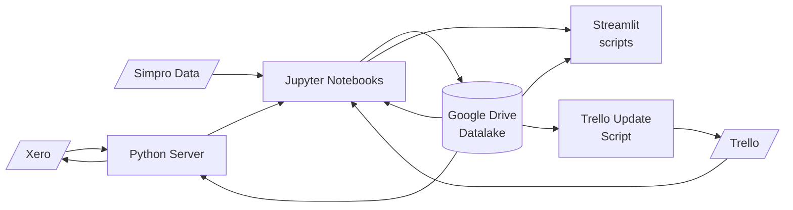
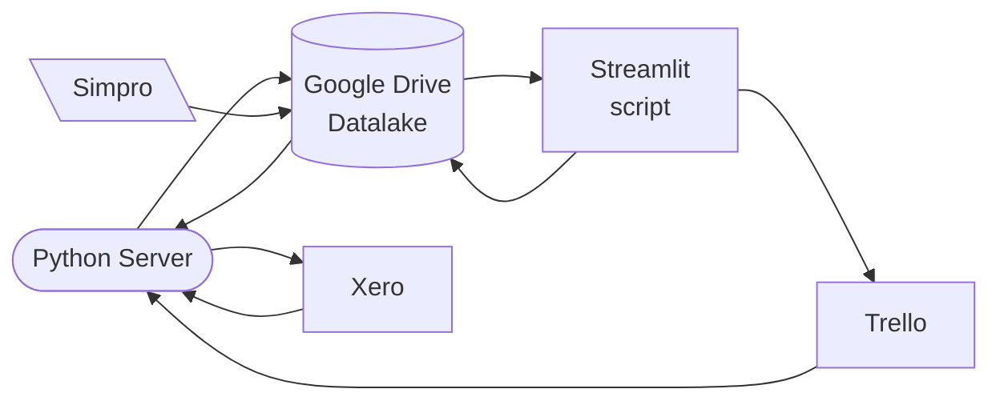
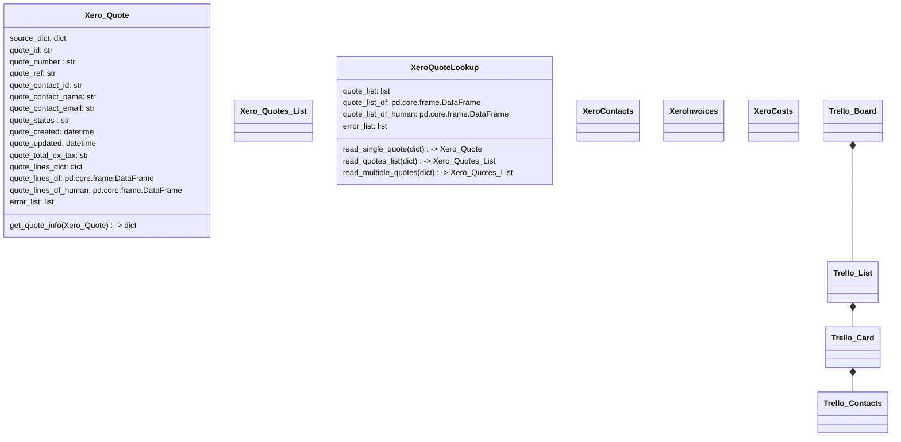
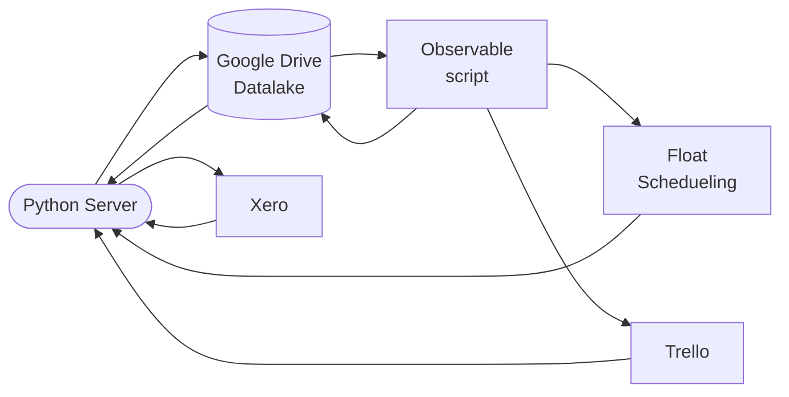
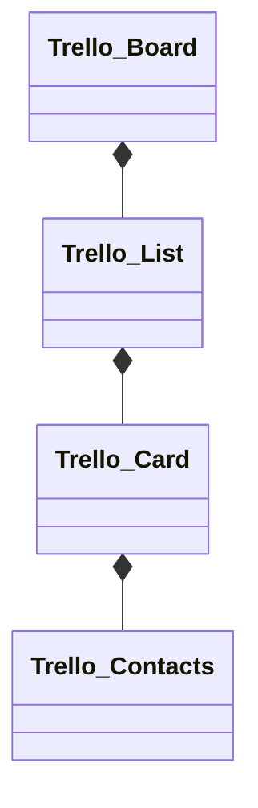
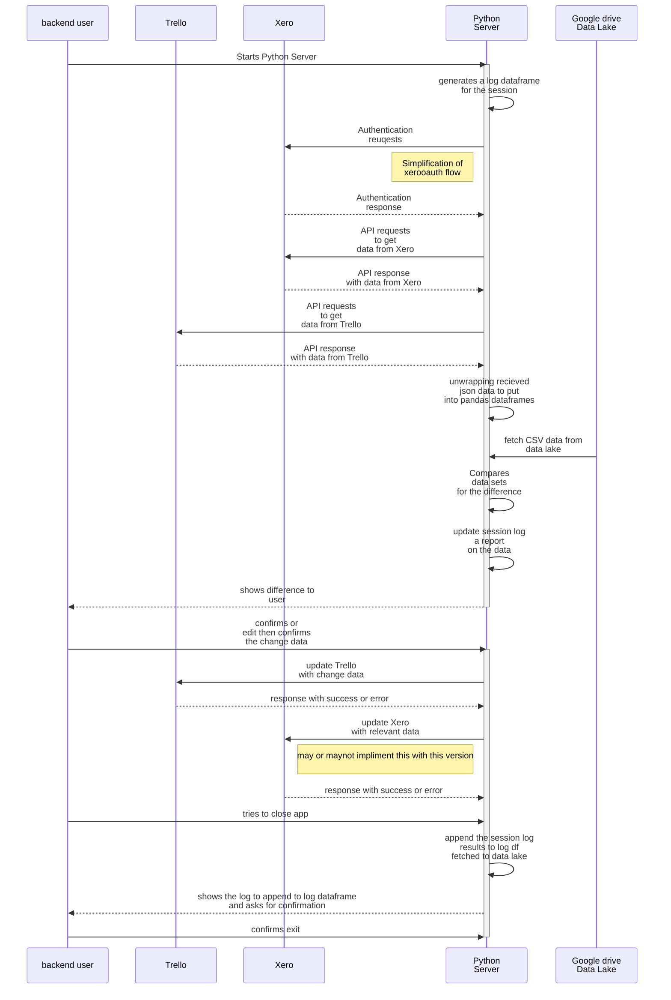
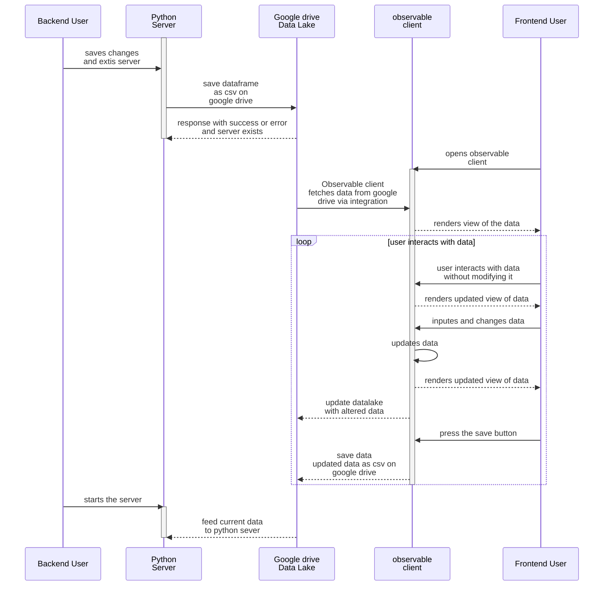

# Enviroflow App Roadmap
## V0.1 - Initial Stable State

- Initial stable version delivering some basic functionality including:
  - fetch, clean and consolidate data into a queryable database for analysis
  - basic interface for low hanging fruit features like:
    - generating the edited job scope list for the subcontractors
    - get a list of what subcontractor quantities are needed for the upcoming job
  - test the robustness of the database on the basis of the small apps
- Update Xero with simpro quotes
- Update Trello with quote quantities
- Update Xero with trello contacts
### Goals - Prioritised
- Analyse, clean and combine the data sets from separate sources.
  - [x] Create stable ways to get structured data from all relevant data sources
    - [x] Simpro
      - [x] Get everything we need out of simpro
    - [x] Xero
      - [x] List of all quotes
        - [x] Fetch quotes
        - [x] Parse quotes
      - [ ] Ways fetch updated quotes from Xero
        - [ ] fetch updated quotes
    - [x] Trello
      - [x] Fetch Trello Cards
  - [x] Get everything into typed data tables
  - [x] Get everything into a database
- [ ] CANCELLED Update Xero with quote contents from Simpro
  - [ ] CANCELLED figure out and create checks for pushing the simpro quotes up

- [x] Get the Simpro info into Xero
- [ ] CANCELLED Get Xero info into Trello
- [ ] CANCELLED Get Trello Contacts into Xero
### Milestone, MVPs
- [x] Extract Simpro data
  - [x] Simpro Quotes from PDF
  - [x] Simpro quote scrape status
  - [x] Simpro Quote Status
  - [x] Job Status in Simpro
  - [x] Quote Activities
  - [x] Invoices from Simpro
  - [x] Simpro Xero log
  - [x] Simpro Customers
  - [x] Notes and update relevant to Simpro Info
  - [x] Uninvoiced Jobs
  - [x] Simpro Invoices
  - [x] Get data typed and queryable
- [x] Extract Xero data
  - [x] Oauth flow to access Xero Api
  - [x] fetch and parse quote data
  - [x] Organise the updates to the list of quotes so the output makes sense
  - [x] make some interfaces to organise fetching data
- [x] Extract Trello data
  - [x] Fetch and parse Trello cards
- [x] Make some interfaces for tasks
  - [x] Generate the scope lists for subcontractors
  - [x] get a list of what subcontractor quantities are needed for the upcoming job
- Flask server
  - [x] Basic interface data
    - [x] Quotes
    - [ ] Cost Journals
    - [ ] Invoices
- Jupyter notebook prototypes for the Enviroflow App
  - [x] Generate scope lists for subcontractors
  - [ ] Get a list of what subcontractor quantities are needed for the upcoming job
    - [ ] Pipe-lining
    - [ ] Concrete
    - [ ] Hydro-seed
    - [ ] Asphalt
    - [ ] Heatpump
    - [ ] Fence
    - [ ] Deck

#### Dataflow

## V0.2
### Goal (MVP)

- Create some simple interactivity and reports on the data.
- One way sync the Xero data into the Trello boards

#### Dataflow

#### Python Server
- Simple flask server
  - in the future will serve up a json api
  - right now it will just destructure the fetched data and generate the data frames we need and save it as CSV
- Handles the o-auth flow with xero's API
- Grabs the needed data from xero and saves it as dataframes
- Grabs the data from Trello and saves it as dataframes
##### Classes on the python server

#### Google Drive Datalake
- Collection of tabular data that is saved to Google Drive
#### Observable Scripts
- Collection of observable hq scripts written in 'kind of' javascript
- can be exported into executable code.
- [duckdb on observable](https://observablehq.com/@cmudig/duckdb)

### Limitations
this design means that the front end and back end users can't simultaniously be accessing the data lake at the same time, it will mean overwriting the pool of data, but that isn't too hard to manage at the moment as there is only one back end user.

should write something to prevent this from happening

## V0.2
### Goal (MVP)
- structure things so we can rapidly prototype and itterate what we do

#### Dataflow

#### Classes on the python server

#### Backend Sequence

#### Frontend Sequence

